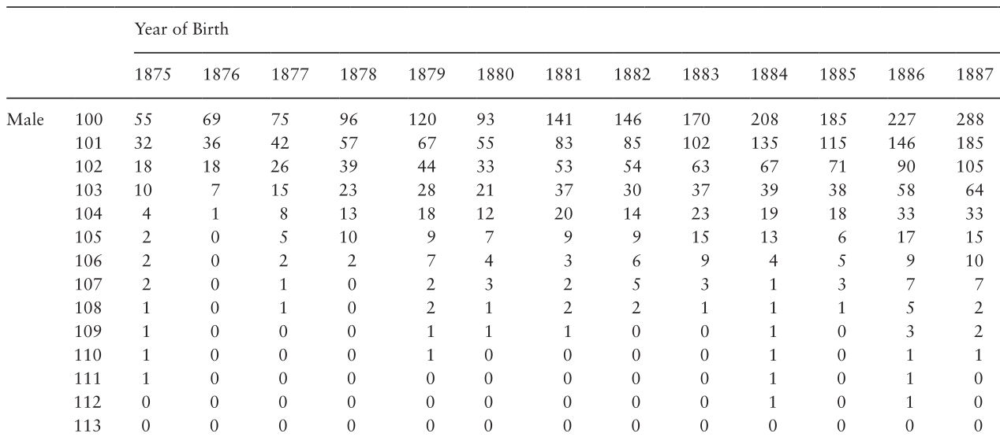

```{r setup, include=FALSE}
knitr::opts_chunk$set(warning = FALSE, message = FALSE,
                      fig.retina = 3, fig.align = "center")
```

```{r packages-data, include=FALSE}
library(tidyverse)
xaringanExtra::use_xaringan_extra(c("tile_view", "webcam"))

```


class: center middle main-title section-title-1

# Informative selection mechanisms for extreme value analyses

.class-info[

**EVA 2021**

.light[Léo Belzile, HEC Montréal]
<br>
Based on joint work with Anthony Davison, Jutta Gampe, Holger Rootzén, Dmitrii Zholud
]


---

class: title title-1 title-1-inv

# Vargas catastrophe

Daily precipitation (in mm) at Maiquetía airport

- Yearly maximum for 1951-1960
- Daily measurements for 1961-1999

1999 catastrophe: cumulative rainfall of 820mm over 3 days (backcast)

- largest record: ~410mm mid-December.
- measurements stop shortly after.
- Accounting (or not) for this observation has a huge impact on inference.


---

class: title title-1 title-1-inv

# Inferential strategy


- Poisson point process formulation: combine yearly maximum with exceedances and stopping rule

- View the largest record as a
 .section-title-1[**stopping rule** ] : set to $s$=282mm, the largest two-day sum previously reported in early 1950s

- Observations before trigger are *right-truncated*, the largest record is *left-truncated* at $s$.

---

class: title title-1 title-1-inv

# Results

```{r maiquetia, echo = FALSE, fig.cap = "Profile likelihood for standard analysis and conditioning on stopping rule (left) and P-P plot of model fitted above 27mm.", out.width ='82%'}
magick::image_read_pdf("figures/profile_hoa_maiquetia.pdf", page = 1)
```

---
class: title title-1 title-1-inv

# How rare was this event?

Q: was the event much larger than one could expect?

Target: median of 50-years maximum


Consider one-sided likelihood ratio test

- $H_0$ : median 50-year maximum > 410.4mm,

- $p$-values 9.5% (unconditional) versus 1.9% (conditional)

.section-title-1[The sampling scheme can have a huge impact on inference.]

---

layout: false
name: IDL
class: title title-2

# Estimating human lifespan

The study of longevity is full of pitfalls...


The first of which is related to the quality of the data

.box-6.medium.sp-after-half[International Database on Longevity (IDL)]

--

- .section-title-2[ **validated supercentenarian (110+) **] from 13 countries

--

- plus (partly validated) .section-title-2[** semi-supercentenarian (105-109)**] for 9 countries

--

- Age-ascertainement bias-free


---
class: title title-2

# Sampling mechanisms

Data are obtained by .section-title-2[**casting a net**] on the population of potential (semi)-supercentenarians.

--

- for IDL, (only) supercentenarians in a country **who died** between dates $c_1$ and $c_2$.

--

- records for the candidates are then individually validated.

---
.box-6.medium.sp-after-half[Lexis diagrams]

```{r lexisdiag, echo = FALSE, fig.cap = "Lexis diagrams showing the selection mechanism.", out.width ='82%'}
magick::image_read_pdf("figures/lexis_selection.pdf", page = 1)
```

---

.box-6.medium.sp-after-half[More complex schemes!]

Semisupercentenarians (105-109) who died in window $(d_1, d_2)\neq (c_1, c_2)$


```{r lexisdiag2, echo = FALSE, fig.cap = "Lexis diagrams for IDL data with semisupercentenarian and supercentenarians", out.width ='85%'}
magick::image_read_pdf("figures/Lexisdiag2.pdf", page = 1)
```

---
class: title title-2  sp-after-half

# Why does it matter?

- .small[Ignoring truncation leads here to underestimation of the survival probability]
- .small[Because of the population increase and reduction in mortality at lower age, larger impact for later cohorts]

```{r artefacts_truncation, echo = FALSE, fig.cap = "Impact of truncation on quantile-quantile plots (left) and maximum age by birth year (right).", out.width ='65%'}
magick::image_read_pdf("figures/truncation_artefacts.pdf", page = 1)
```

---
class: title title-2

# Complications ahead

Accounting for interval truncation.

- e.g., the plotting position for $x$-axis of Q-Q plot for observation $y_i$ is
$$
F_0^{-1}\left[F_0(a_i) +\left\\{ F_0(b_i)-F_0(a_i) \right\\} \frac{F_n(y_i) - F_n(a_i)}{F_n(b_i)-F_n(a_i)}\right]
$$
where
- $F_0$ is the postulated (i.e., fitted) parametric distribution,
- $F_0^{-1}$ is the corresponding quantile function,
- $F_n$ is the NPMLE of the distribution function (Turnbull, 1976).


---
class: title title-2

# Truncation can be hidden

- .section-title-2[ Extinct cohort ]: Birth cohorts for which no death has been reported for X consecutive years.
- counts cross-tabulated by years of birth, age (rounded down to nearest year) and gender

```{r countdata, echo = FALSE, out.width ='55%', fig.cap = "Annual Vital Statistics Report of Japan (Hanamaya & Sibuya, 2014)."}

```

---
class: title title-2
# Impacts of interval censoring

Japanese (unvalidated) data are interval-censored and right-truncated

```{r japanese, echo = FALSE, fig.cap = "Profile likelihood ratio confidence intervals by threshold (left) and sampling distribution with(out) rounding (right).", out.width ='65%'}
magick::image_read_pdf("figures/02-japanese_freq.pdf", page = 1)
```

---
name: outline
class: title title-2

# Lack of (threshold) stability

- .small[The hazard doesn't stabilize until 106 years or so.]

```{r thstab, echo = FALSE, fig.cap = "Threshold stability plots for France and Italy (left), and Netherlands (right).", out.width ='60%'}
magick::image_read_pdf("figures/threshold_stability2.pdf", page = 1)
```
Take home message: one cannot use low thresholds for extrapolation.


---
name: outline
class: title title-2

# Is the lifetime distribution bounded?

Mathematically speaking, is $t_F=\sup\{t: F(t)<1\} = \infty$?

```{r profile_lifetime, echo = FALSE, fig.cap = "Profile likelihood for endpoint for various countries and three thresholds.", out.width ='80%'}
magick::image_read_pdf("figures/profile_endpt.pdf", page = 1)
```


---
class: title title-2

# You have no power in here!

The power of a likelihood ratio test for detecting a finite endpoint (obtained by simulating records with a generalized Pareto distribution with lifespan $t_F$) is high: based on France/Italy/IDL data (2016 version),

- 125 years: combined power of 97%;
- 130 years: combined power of 83%;
- 135 years: combined power of 66%.

Suggests that the human lifespan lies well beyond any lifetime yet observed
---

name: outline
class: title title-2

# Supercentenarians [don't] live forever...

- Estimated exponential distribution above 110 years has mean 0.5 (0.46, 0.53)

--

- Surviving until 130 years conditional on surviving until 110 years
  - is equivalent to obtaining 20 heads in a row
  - a less than one-in-a-million chance...

---

# References

- Léo R. Belzile, Anthony C. Davison, Jutta Gampe, Holger Rootzén and Dmitrii Zholud (2022). Is there a cap on longevity? A statistical review., Annual Reviews of Statistics and its Applications.
- Léo R. Belzile and Anthony C. Davison (2020). Improved inference for risk measures of univariate extremes (2021+), arXiv:2007.10780 preprint.
- Léo R. Belzile, Anthony C. Davison, Holger Rootzén and Dmitrii Zholud (2021+). Human mortality at extreme age., arXiv:2001.04507 preprint.
